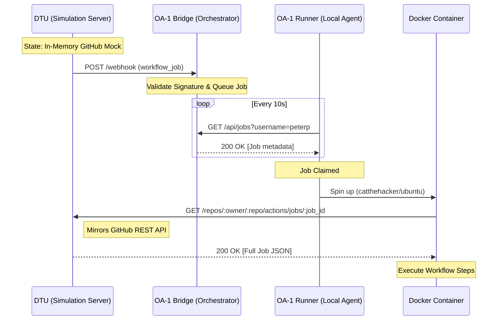

# GitHub Actions Specification (OA-1 & DTU)

This document defines the technical communication flow between the Digital Twin Universe (DTU), the OA-1 Bridge, and the Local Runner.

## System Architecture

The Opposite-Actions (OA-1) system mimics GitHub's pull-based runner architecture. In the local-first environment (DTU), components interaction is defined as follows:



---

## 1. Digital Twin Universe (DTU) API

The DTU provides a mirrored GitHub API to ensure that production code running inside containers interacts with a "real" (simulated) GitHub environment.

### GitHub REST API Mirror
**Endpoint**: `GET /repos/{owner}/{repo}/actions/jobs/{job_id}`  
**Source of Truth**: [GitHub REST API Documentation](https://docs.github.com/en/rest/actions/workflow-jobs#get-a-job-for-a-workflow-run)

**Example Response**:
```json
{
  "id": 12345678,
  "run_id": 87654321,
  "status": "queued",
  "labels": ["ubuntu-latest"],
  "head_sha": "d00d1e...",
  "steps": []
}
```

### Internal DTU Seeding
**Endpoint**: `POST /_dtu/seed`  
Used by simulation scripts (`dtu/github-actions/simulate.ts`) to populate the mock server state.

---

## 2. The GitHub Long-Poll

Even if the Bridge says you are "active," GitHub itself won't send the job to your machine unless the official GitHub Actions self-hosted runner application is running and connected to GitHub’s servers.

### How it works
When your YAML says `runs-on: opposite-actions`, GitHub looks for an open HTTPS long-poll connection from a runner registered to that repo with that label.

1.  **Registration**: The official runner application (`./run.sh`) must be registered with the repository or organization.
2.  **Connection**: Once started, it maintains a persistent connection to GitHub.
3.  **Job Assignment**: If the connection isn't open, the job will hang in "Queued" status even if your Bridge check passed.

### OA-1 Integration
The local OA-1 Runner initiates the standard GitHub Actions self-hosted runner process (`./run.sh`) automatically if configured. This ensures that GitHub can "see" the runner and assign jobs to it, while the OA-1 Runner provides the enhanced orchestration and local-first features.

---

## 2. OA-1 Bridge API

The Bridge acts as the message queue and presence orchestrator.

### Webhook Ingestion
**Endpoint**: `POST /api/webhook`  
**Description**: Receives `workflow_job` events from GitHub (or DTU).  
**Security**: Validates `X-Hub-Signature-256` using `GITHUB_WEBHOOK_SECRET`.

### Job Polling
**Endpoint**: `GET /api/jobs?username={username}`  
**Description**: Runners poll this endpoint to announce availability and retrieve queued jobs.  
**State**: Responding with a list of job metadata (IDs and tokens).

---

## 3. Communication Flow

1.  **Event Trigger**: The `pnpm run simulate:dev` script seeds the DTU mock server with job details and then POSTs a `workflow_job` event to the Bridge.
2.  **Job Queuing**: The Bridge identifies the user, checks if the runner is online, and queues the job metadata.
3.  **Runner Activation**: The local runner, polling every 10 seconds, receives the job metadata.
4.  **Docker Lifecycle**: The runner creates a container. It injects `GITHUB_API_URL` (pointing to the DTU server) and `GITHUB_TOKEN`.
5.  **Direct Pull**: Inside the container, the bootstrap script calls the DTU server directly to fetch its own "Plan" (steps, secrets, etc.).

---

## 4. Why this matters for "Opposite-Actions"

By mirroring the official GitHub API in the DTU, we ensure that:
- **Zero code changes**: The runner container doesn't know it's not talking to GitHub.
- **Local Isolation**: You can develop and test CI logic without any internet connection.
- **Technical Accuracy**: The system follows the exact same pull-based logic as the official GitHub Actions runner.